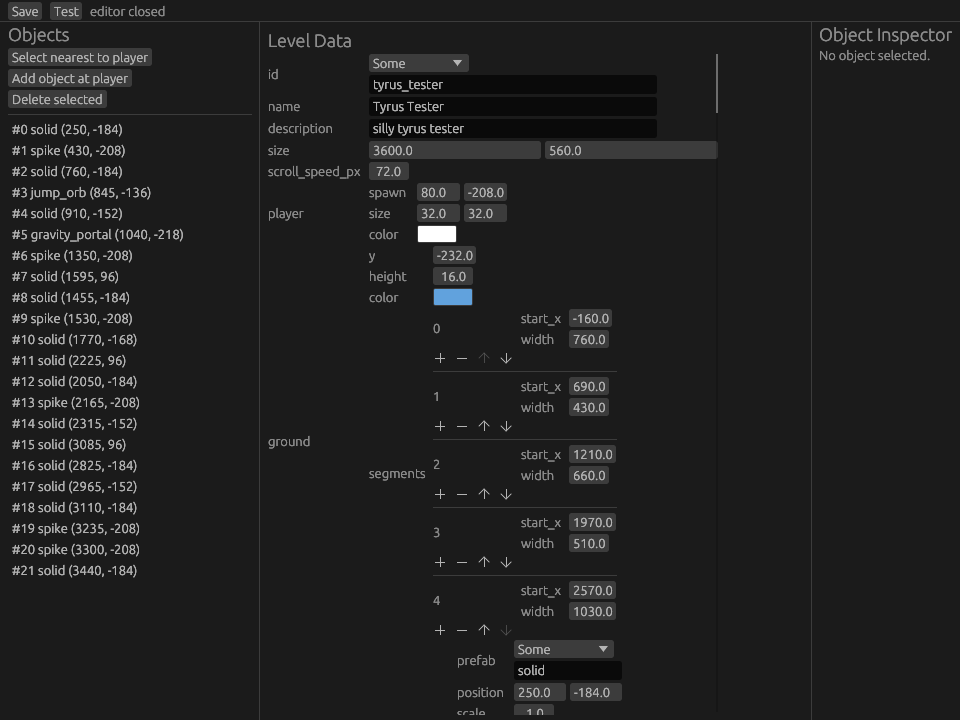

# Term Dash

Geometry dash in your terminal.

<table>
  <tr>
    <td width="65%">
      
    </td>
    <td width="35%">
      
    </td>
  </tr>
  <tr>
    <td align="center">
      <em>Gameplay</em>
    </td>
    <td align="center">
      <em>Level Editor</em>
    </td>
  </tr>
</table>

It is written in Rust and Bevy.

I've been wanting to make a game for a while and learn Rust and Bevy. The terminal is cool. Geometry dash is a classic game. Combine them :)

I started making this for Hack Club Horizons.

# Features

* Geometry Dash-style gameplay in the terminal
* Built with Rust and Bevy
* Graphical level editor
* Live editing and testing
* Audio visualiser* (it's fake, but you won't tell!)

# Controls

* Space: Jump
* Arrow keys: Up, Down, Left, Right
* menu controls are written in game

# Usage

Precompiled builds are there for:

* Linux x86_64, built on Ubuntu 20.04 for a glibc 2.31 baseline
* macOS x86_64 for Intel Macs
* macOS aarch64 for Apple Silicon Macs
* Windows x86_64 for Windows 10/11

You can also clone the repository:

```bash
git clone https://github.com/intercepted16/termdash
cd termdash
cargo run
```

which will handle everything for you.

# Credits

* Rust
* Bevy as a game engine
* bevy_ratatui and bevy_ratatui_camera for rendering in the terminal
* ratatui for terminal UI
* egui and bevy_inspector_egui for the editor window

Literally insane how much code these saved me, love it.

## Music

* Field of Memories

